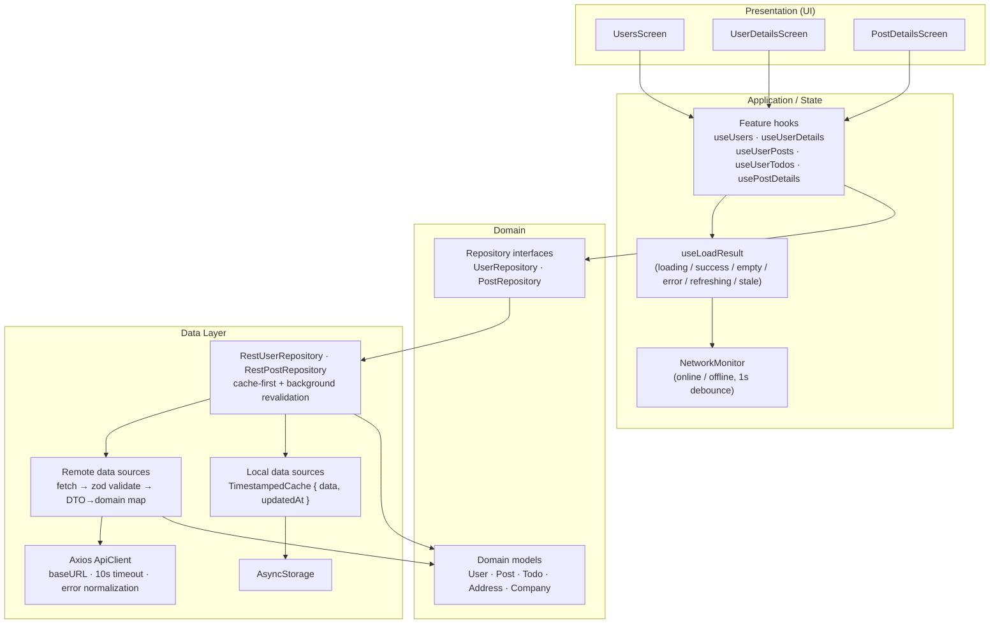
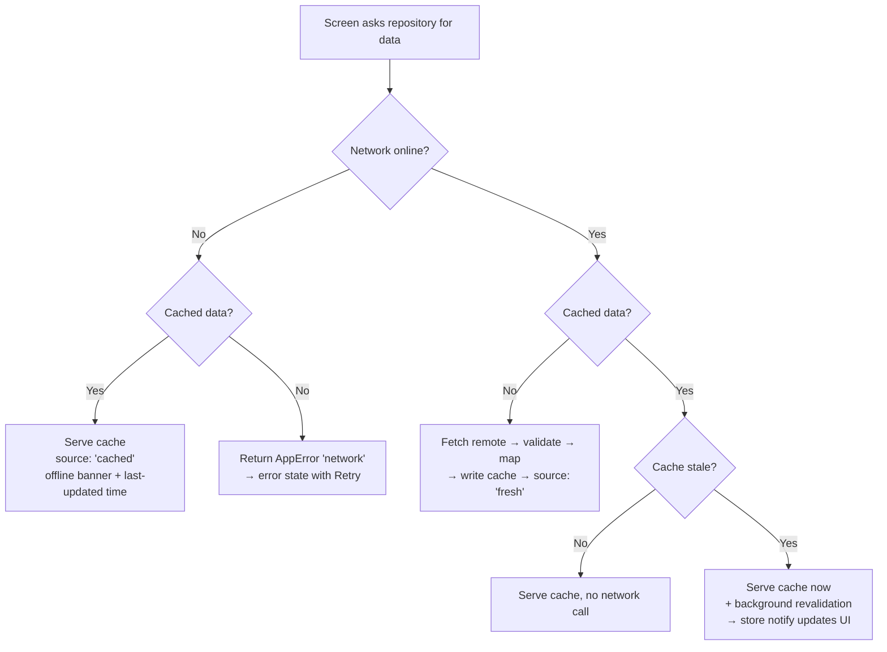

# KqTest — Offline-First React Native App

A production-grade, offline-capable React Native (Expo SDK 57) application that consumes the [JSONPlaceholder](https://jsonplaceholder.typicode.com) REST API (Users, Posts, Todos) using **clean architecture**, **repository-based data access**, **DTO → domain mapping**, **runtime validation**, and an **offline-first cache strategy**.

The UI never talks to Axios, `fetch`, AsyncStorage, or NetInfo directly. It only ever sees **domain models** and **application-level states**.

---

## Table of contents

1. [Tech stack](#tech-stack)
2. [Architecture](#architecture)
3. [Data flow](#data-flow)
4. [Why AsyncStorage](#why-asyncstorage)
5. [Caching strategy](#caching-strategy)
6. [Offline strategy](#offline-strategy)
7. [State management](#state-management)
8. [Error normalization](#error-normalization)
9. [DTOs vs domain models](#dtos-vs-domain-models)
10. [Project structure](#project-structure)
11. [Setup & run](#setup--run)
12. [Environment / configuration](#environment--configuration)
13. [Testing](#testing)
14. [Acceptance checklist](#acceptance-checklist)

---

## Tech stack

| Concern | Choice | Why |
| --- | --- | --- |
| Framework | Expo SDK 57 + React Native 0.86, TypeScript (strict) | Universal, maintained, runs in Expo Go |
| Navigation | `expo-router` (Stack) | File-based routing; typed routes |
| HTTP | `axios` | Centralized client, interceptors, timeout, mature error typing |
| Validation | `zod` | Runtime schema validation of API payloads |
| Local storage | `@react-native-async-storage/async-storage` | Works in **Expo Go**, zero native config, adequate for small JSON caches |
| Network | `@react-native-community/netinfo` | Connectivity state + restore detection, works in Expo Go |
| State | Custom hooks + React Context (DI container) + reactive in-memory store | Full control over offline-first semantics; server state lives in repositories |
| Tests | `jest-expo` + `@testing-library/react-native` | Official Expo testing setup |

Only dependencies that are clearly warranted were added. No state library (Redux/Zustand/TanStack Query) was pulled in because the server state is fully managed by the repository layer with a tiny reactive store — adding a query library would duplicate that logic.

---

## Architecture

```
UI / Presentation (screens, components)
        ↓   depends on hooks only
Application / State (feature hooks + useLoadResult)
        ↓   depends on repository interfaces
Repositories (RestUserRepository, RestPostRepository)
        ↓
Data Sources
   ↙                        ↘
Remote API  (ApiClient → DTO → zod → mapper)   Local Storage (TimestampedCache → domain)
```

**Dependency direction** (enforced by convention, verified by review):

```
UI → Application → Domain → Repository Interfaces
                                      ↑
                         Data Layer (Remote API + Local Storage)
```

Rules enforced in code:

- Screens import **domain models** (`User`, `Post`, `Todo`) and feature hooks only.
- `axios`, `fetch`, AsyncStorage, NetInfo, Zod are **never imported** by the presentation layer.
- The storage abstraction (`Storage` interface) hides AsyncStorage; the network abstraction (`NetworkMonitor` interface) hides NetInfo.
- Repositories are plain classes with **constructor injection** (remote data sources, local data sources, network monitor), which makes them trivially testable with fakes.
- The DI container (`src/providers/container.ts`) is assembled once and provided through React Context.

---

## Data flow

### End-to-end dependency flow



The presentation layer reads domain models; repositories decide **where** data comes from (network vs cache) and the UI only ever receives `LoadResult<T>` (data + `fresh | cached` source + sync timestamp).

### Fresh load (online, no cache)

```mermaid
sequenceDiagram
    autonumber
    participant UI as UsersScreen
    participant H as useUsers
    participant R as RestUserRepository
    participant L as Local cache
    participant DS as Remote data source
    participant API as Axios ApiClient
    participant W as JSONPlaceholder

    UI->>H: mount
    H->>R: getUsers()
    R->>L: read cache
    L-->>R: miss
    R->>DS: fetchUsers()
    DS->>API: GET /users
    API->>W: HTTP request
    W-->>API: raw JSON
    API-->>DS: raw JSON
    DS->>DS: validate with zod → map DTO → domain
    DS-->>R: Result&lt;User[]&gt; (domain)
    R->>L: setUsers(data, updatedAt=now)
    R-->>H: LoadResult { data, source: "fresh" }
    H-->>UI: success + fresh
```

### Cached load (online, stale cache)

```mermaid
sequenceDiagram
    autonumber
    participant UI as UserDetailsScreen
    participant HP as useUserPosts
    participant HT as useUserTodos
    participant R as RestUserRepository
    participant L as Local cache
    participant DS as Remote data source

    Note over UI,R: Posts and Todos requested in parallel
    UI->>HP: mount
    UI->>HT: mount
    HP->>R: getUserPosts(userId)
    HT->>R: getUserTodos(userId)
    R->>L: read cache
    L-->>R: hit (stale &gt; 5 min)
    R-->>HP: LoadResult { data, source: "cached", isStale }
    R-->>HT: LoadResult { data, source: "cached", isStale }
    HP-->>UI: show cached posts + stale banner
    HT-->>UI: show cached todos + stale banner
    R->>DS: background fetchPostsByUser(userId)
    R->>DS: background fetchTodosByUser(userId)
    DS-->>R: fresh domain data
    R->>L: setPosts / setTodos (update timestamp)
    R-->>HP: store notify → re-render fresh
    R-->>HT: store notify → re-render fresh
```

### Offline load (cache hit / cache miss)



## Why AsyncStorage

The specification asked for an explicit evaluation of storage options. The deciding factor is **Expo Go compatibility**:

| Solution | Works in Expo Go | Query | Sync | Notes |
| --- | --- | --- | --- | --- |
| **AsyncStorage** | ✅ | No | Yes | Good fit for JSON caches up to a few MB |
| MMKV | ❌ (requires native rebuild) | No | Yes | Faster sync reads, but breaks Expo Go |
| SQLite / WatermelonDB | ⚠️ (WatermelonDB needs native) | ✅ | Yes | Overkill for three small collections |
| Realm | ❌ (native module) | ✅ | Yes | Heavy dependency, native build required |

The data volume here is tiny (10 users, ~100 posts, ~200 todos as JSON). A synchronous native KV store buys little and would force a development build. AsyncStorage is asynchronous, persistent, has zero native setup, and is included in Expo Go — the right trade-off for maintainability and portability. The `Storage` interface means swapping to MMKV/SQLite later is a one-file change.

---

## Caching strategy

**Cache-first with background revalidation (stale-while-revalidate).**

For every collection/entity the repository:

1. Reads the local cache first.
2. **If cached data exists and we are online**: returns it immediately (marked `source: 'cached'`) and fires a background refresh (`RefreshCoordinator`) that re-fetches, updates the cache, and notifies subscribers — the UI updates in place when fresh data lands.
3. **If cached data exists and we are offline**: returns it immediately (marked `source: 'cached'`).
4. **If no cache**: awaits the network, validates, maps, writes the cache, and returns `source: 'fresh'`. On failure returns a normalized error.
5. **If a refresh fails**: cached data is retained; the error is surfaced only as a non-destructive refresh error.

Every cache entry stores `{ data, updatedAt }`. `updatedAt` is the last successful synchronization timestamp and drives the **"Last updated X minutes ago"** UI. If the API returns an empty array for posts/todos it is cached as such, but the UI renders the correct empty state.

The UI can therefore distinguish: **loading**, **fresh**, **cached/stale**, **empty**, **error**, **refreshing**.

---

## Offline strategy

- A `NetworkMonitor` (backed by NetInfo) exposes reactive `online/offline/unknown` state with a **1s debounce** to avoid churn when connectivity flaps.
- Offline requests never touch the network: repositories read the cache and return `source: 'cached'`, or a domain `network` error when there is nothing cached.
- The UI shows an **"Offline — showing cached data"** banner and a **last-sync timestamp** whenever data is served from cache.
- On **connection restore**, the app triggers automatic background refreshes (`refreshOnReconnect`), which update caches and timestamps.
- Pull-to-refresh keeps existing content visible, shows the native refreshing indicator, and never destroys usable cached data if the refresh fails.

---

## State management

No heavyweight server-state library. State is split deliberately:

- **Server state** — lives inside repositories as a `ReactiveStore` (`Map<key, LoadResult>`). Background refresh completion writes to the store and notifies subscribers.
- **Persistent cache** — lives in AsyncStorage via `TimestampedCache`.
- **Network state** — lives in the `NetworkMonitor`, exposed through context.
- **UI state** — lives in screens/components (search query, etc.).

A single shared hook, `useLoadResult<T>`, bridges repositories to React:

- runs the cache-first `load` on mount,
- subscribes to the repository store so background refreshes re-render in place,
- exposes `refresh()` for pull-to-refresh without clearing current data,
- collapses results into `loading | success | empty | error` with `isRefreshing`.

Feature hooks (`useUsers`, `useUserPosts`, `useUserTodos`, …) wire the container repositories into `useLoadResult`.

---

## Error normalization

All infrastructure errors are converted at the data boundary into a typed domain error:

```ts
type AppErrorKind = 'network' | 'timeout' | 'server' | 'notFound' | 'validation'
                  | 'unauthorized' | 'forbidden' | 'rateLimited' | 'unknown';
```

`toAppError` (in the API client) maps:

- Axios codes (`ERR_NETWORK`, `ENOTFOUND`, `ECONNREFUSED`, …) → `network`
- `ECONNABORTED` / `ETIMEDOUT` / HTTP 408 → `timeout`
- 400 → `validation`, 401 → `unauthorized`, 403 → `forbidden`, 404 → `notFound`, 429 → `rateLimited`
- 500/502/503/504 → `server`
- anything else → `unknown`

Errors are **retryable** when it makes sense (network/timeout/server/rate-limited). Zod validation failures inside data sources become `validation` errors. Screens map `AppError` to user-friendly copy via `toUserMessage`; raw Axios/fetch errors never reach the UI.

---

## DTOs vs domain models

- **DTOs** (`UserDto`, `PostDto`, `TodoDto`) describe the wire format and are validated with **zod schemas** before use. Missing/`null` fields are defaulted; wrong types fail validation and become `validation` errors rather than crashes.
- **Domain models** (`User`, `Post`, `Todo`, `Address`, `Company`) are what the UI consumes.
- **Mappers** (`user-mapper`, `post-mapper`, `todo-mapper`) convert DTO → domain inside the data layer.

Example of the boundary: the raw API shape `user.address.geo.lat` is mapped into a clean `User.address.geo` domain object. No component ever reads the API response shape.

---

## Project structure

```
src/
├── app/                       # expo-router routes (screens are wired here)
│   ├── _layout.tsx            # Stack navigation + AppProvider
│   ├── index.tsx              # Users list (search, pull-to-refresh)
│   ├── user/[id].tsx          # User details (Posts + Todos, parallel, independent)
│   └── post/[id].tsx          # Post details
│
├── config/                    # API config (base URL, timeout)
├── providers/                 # DI container + React context
│
├── core/
│   ├── errors/                # AppError, user-message mapping
│   ├── logger/                # structured dev logging (no-ops in prod)
│   ├── network/               # NetworkMonitor interface + NetInfo impl
│   ├── result/                # Result<T> (ok/fail)
│   ├── storage/               # Storage interface, AsyncStorage adapter, JSON storage
│   └── utils/                 # parseWith (zod wrapper), time helpers
│
├── domain/
│   ├── models/                # User, Post, Todo, Address, Company, LoadResult
│   └── repositories/          # UserRepository, PostRepository interfaces
│
├── data/
│   ├── api/
│   │   ├── client/            # ApiClient (axios, timeout, error normalization)
│   │   ├── dto/               # DTO types + zod schemas
│   │   └── dataSources/       # remote data sources (fetch → validate → map)
│   ├── local/
│   │   ├── cache/             # TimestampedCache (data + updatedAt)
│   │   └── dataSources/       # local data sources (read/write cache)
│   ├── mappers/               # DTO → domain mappers
│   └── repositories/          # RestUserRepository, RestPostRepository
│
├── features/
│   ├── users/  (hooks)        # useUsers, useUserDetails, useUserSearch
│   ├── posts/  (hooks)        # useUserPosts, usePostDetails
│   └── todos/  (hooks)        # useUserTodos
│
├── shared/
│   ├── components/            # Skeleton, EmptyState, ErrorState, OfflineBanner,
│   │                          # LastUpdated, LoadableSection
│   └── hooks/                 # useLoadResult (shared state machine)
│
└── test-utils/                # MemoryStorage, FakeNetworkMonitor, harness builder
```

---

## Setup & run

```bash
npm install          # install dependencies
npm run start        # start Expo dev server (Expo Go / simulator / web)
npm run ios          # open on iOS simulator
npm run android      # open on Android emulator
npm run web          # open in browser
```

> The app runs in **Expo Go** — no native build is required.

---

## Environment / configuration

Configuration is kept separate from code and read via Expo public env vars (`.env`):

```
EXPO_PUBLIC_API_BASE_URL=https://jsonplaceholder.typicode.com
```

If unset, the app defaults to the JSONPlaceholder base URL (see `src/app/config/api.ts`). No secrets are hardcoded; nothing sensitive is logged. Logging is compiled out in production builds (`__DEV__` guard).

---

## Testing

```bash
npm run test          # run all tests once
npm run test:watch    # watch mode
npm run typecheck     # tsc --noEmit (TypeScript strict)
npm run lint          # expo lint (ESLint)
```

Test coverage:

- **Mappers** — DTO → domain mapping (`user/post/todo`).
- **Validation** — zod schemas reject malformed payloads, default missing fields, and normalize `null`.
- **Error normalization** — `toAppError` maps every HTTP status / network code.
- **Repositories** — online+fresh, online+fail+cache, online+fail+no-cache, offline+cache, offline+no-cache, malformed responses, partial posts/todos failure, request deduplication, background revalidation.
- **Cache** — persistence across "app restarts", timestamps, lookups.
- **Components/screens** — loading, loaded, empty, error, offline banner, retry; Users screen rendered through mocked hooks.

Tests use in-memory fakes (`MemoryStorage`, `FakeNetworkMonitor`, mocked data sources) — they never call JSONPlaceholder.

---
